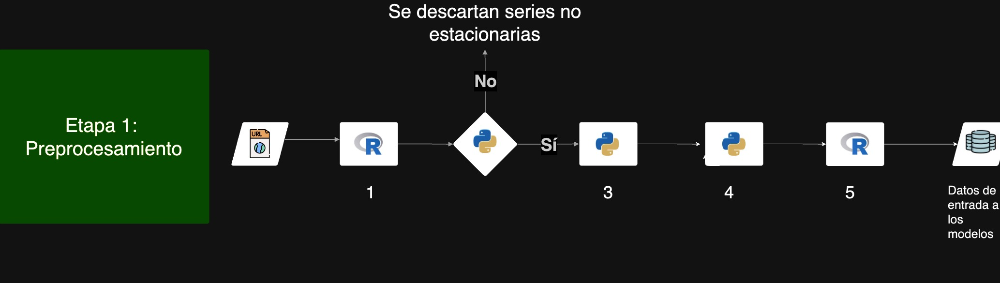

# Estructura carpetas
## /data: 
datos del estudio
## /docs: 
imagenes y otros
## /utils: 
archivos con funciones que se emplean en archivos de src
## /implementation: 
Etapa 1: Preprocesamiento
1) step1_fred_upload_preprocess.R
2) step2_1_adf_tests.py y step2_2_kpss_tests_best.py
3) step3_slow_fast.py
4) step4_split_train_test.py
5) step5_favar_ddfm_input_data.R
   

   
Etapa 2: Estimacion de los modelos (se siguen los scripts de las carpetas)
1) step1_IC_factor_number
2) step2_FAVAR_lineal
3) step3_DDFM_FAVAR_profundo
4) step4_VI

